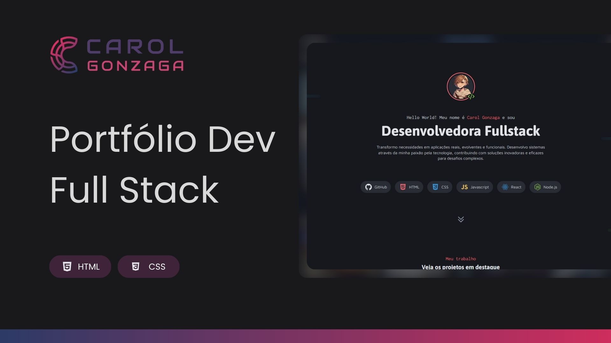

  

 

Desenvolvimento de um site de portfólio para consolidar habilidades em CSS Grid e Flexbox.

  <a href="#-tecnologias">Tecnologia</a>&nbsp;&nbsp;&nbsp;|&nbsp;&nbsp;&nbsp;<a href="https://carolgonzaga.github.io/portfolio-dev/">Acesse o Projeto</a>

 
 

  

 
 

## 🚀 Tecnologias

Esse projeto foi desenvolvido com as seguintes tecnologias:

- HTML5
- CSS3
- CSS Grid
- CSS Flexbox
- Variáveis CSS
- Pseudo-classes e Pseudo-elementos

 
 

## 🎯 Objetivo

O objetivo desse desafio é consolidar conhecimentos sobre layout e posicionamento de elementos usando CSS Grid e Flexbox.
